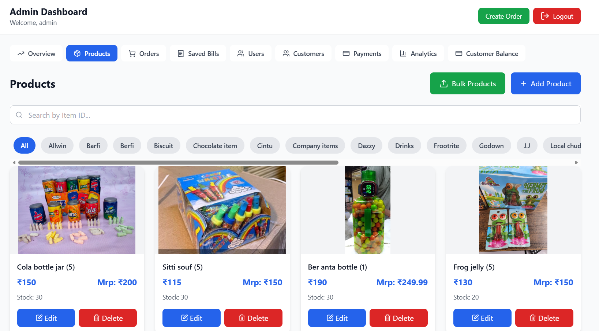
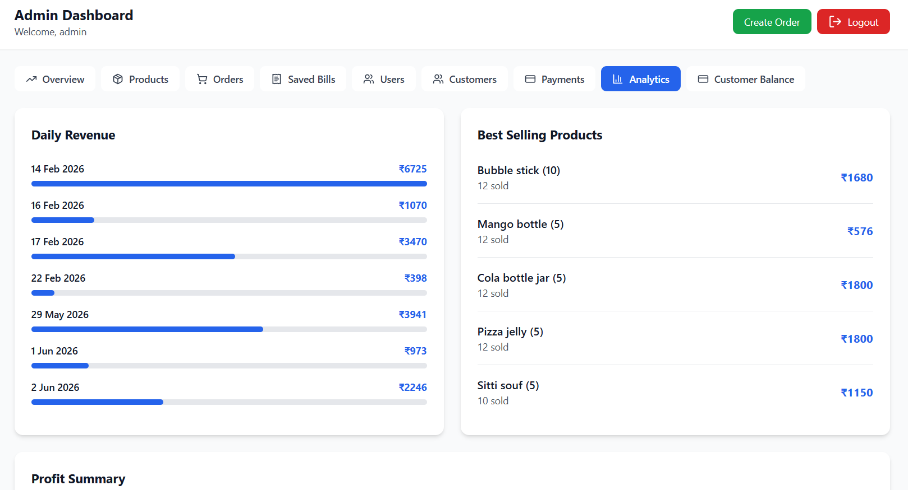
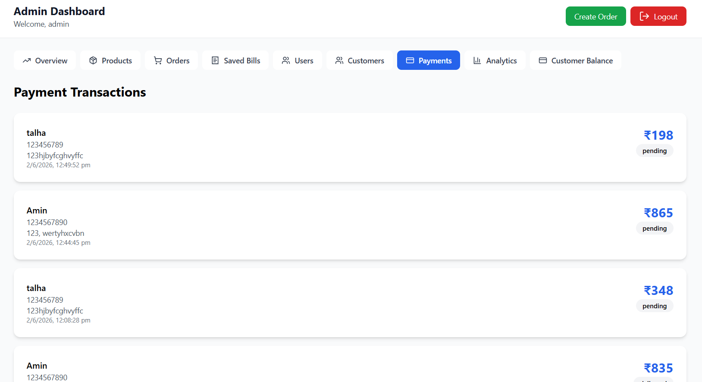
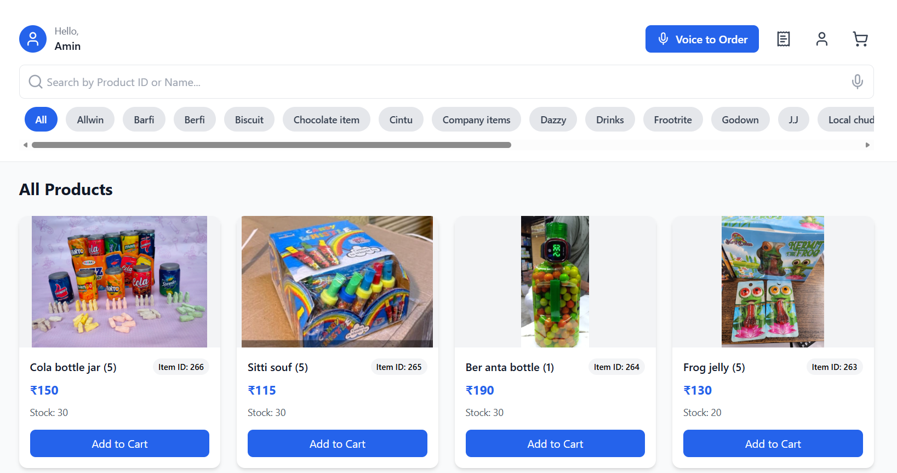
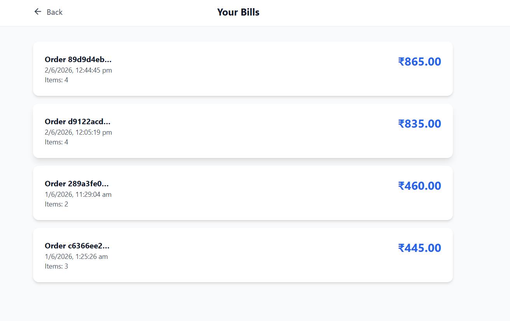

<p align="center">
  
</p>

<h1 align="center">🛒 M.A Bazaar</h1>

<p align="center">
  A full-featured e-commerce and order management platform built for a retail bazaar business — with role-based dashboards, voice-to-order AI, PDF/Excel export, and a native Android app.
</p>

<p align="center">
  
  
  
  
  
</p>

---

## 📑 Table of Contents

- [Screenshots](#-screenshots)
- [Features](#-features)
- [Tech Stack](#-tech-stack)
- [Folder Structure](#-folder-structure)
- [Environment Variables](#-environment-variables)
- [Getting Started](#-getting-started)
- [Available Scripts](#-available-scripts)
- [License](#-license)

---

## 📸 Screenshots

| Admin Dashboard | Admin Products |
|:-:|:-:|
|  |  |

| Admin Analytics | Admin Payments |
|:-:|:-:|
|  |  |

| User Dashboard | User Bills |
|:-:|:-:|
|  |  |

| Voice-to-Order | Employee Dashboard |
|:-:|:-:|
|  | .png) |

---

## ✨ Features

### 👤 Customer Portal
- 🏠 **Home & Product Browsing** — Browse and search products
- 🛒 **Cart & Checkout** — Add items, review cart, and place orders
- 🎤 **Voice-to-Order** — AI-powered voice input to create orders hands-free
- 🧾 **Bills & Receipts** — View and track order history
- 👤 **Profile Management** — Manage account details

### 👷 Employee Dashboard
- 📦 **Order Management** — View, edit, and deliver customer orders
- ✏️ **Order Editing** — Modify order details via modal interface

### 🔧 Admin Panel
- 📊 **Analytics Dashboard** — Business insights and sales data
- 📦 **Product Management** — Add single or bulk upload products
- 💰 **Customer Balances** — Track customer credit and payments
- 🧾 **Billing & Invoices** — Manage bills and generate reports
- 👥 **User Management** — View and manage registered users
- 💳 **Payment Tracking** — Monitor all payment transactions

### 📱 Cross-Platform
- 📲 **PWA Support** — Installable on any device
- 🤖 **Android App** — Native Android build via Capacitor
- 📄 **PDF & Excel Export** — Generate reports with jsPDF and XLSX

---

## 🛠️ Tech Stack

| Category | Technology |
|----------|-----------|
| **Frontend** | React 18, TypeScript |
| **Build Tool** | Vite 5, vite-plugin-pwa |
| **Styling** | Tailwind CSS |
| **Routing** | React Router DOM 7 |
| **Backend** | Supabase (Database, Auth, RLS) |
| **AI** | OpenAI (Gemini API for voice transcription) |
| **Mobile** | Capacitor (Android) |
| **Export** | jsPDF, XLSX |
| **Icons** | Lucide React |

---

## 📁 Folder Structure

```
ma_bazaar/
├── public/
│   ├── project_image/             # 📸 Screenshots & demo images
│   ├── pwa-192x192.png            # PWA icons
│   └── pwa-512x512.png
├── src/
│   ├── components/
│   │   └── AuthGuard.tsx          # 🔐 Auth protection wrapper
│   ├── lib/
│   │   └── supabase.ts           # Supabase client config
│   ├── pages/
│   │   ├── Auth.tsx               # Authentication page
│   │   ├── admin/                 # 🔧 Admin pages
│   │   │   ├── AdminDashboard.tsx
│   │   │   ├── AdminOrderPage.tsx
│   │   │   ├── BulkProductUpload.tsx
│   │   │   ├── CreateOrder.tsx
│   │   │   ├── CustomerBalance.tsx
│   │   │   └── CustomerBills.tsx
│   │   ├── employee/              # 👷 Employee pages
│   │   │   ├── EmployeeDashboard.tsx
│   │   │   ├── Deliver.tsx
│   │   │   └── EditOrderModal.tsx
│   │   └── user/                  # 👤 Customer pages
│   │       ├── Home.tsx
│   │       ├── Cart.tsx
│   │       ├── Checkout.tsx
│   │       ├── Bills.tsx
│   │       ├── Profile.tsx
│   │       └── VoiceToOrderModel.tsx
│   └── pages/api/
│       └── transcribe.ts         # 🎤 Voice transcription API
├── android/                       # 📱 Capacitor Android project
├── capacitor.config.ts
├── package.json
└── vite.config.ts
```

---

## 🔑 Environment Variables

Create a `.env` file in the root directory:

```env
# Supabase
VITE_SUPABASE_URL=https://your-project.supabase.co
VITE_SUPABASE_ANON_KEY=your_supabase_anon_key

# Gemini AI (Voice-to-Order)
GEMINI_API_KEY=your_gemini_api_key
```

| Variable | Description | Required |
|----------|-------------|:--------:|
| `VITE_SUPABASE_URL` | Supabase project URL | ✅ |
| `VITE_SUPABASE_ANON_KEY` | Supabase anonymous key | ✅ |
| `GEMINI_API_KEY` | Google Gemini API key (voice transcription) | ✅ |

---

## 🚀 Getting Started

### Prerequisites

- **Node.js** 18+
- **npm**, **yarn**, or **pnpm**
- [Supabase](https://supabase.com) project
- [Google AI Studio](https://aistudio.google.com) API key
- **Android Studio** (optional, for Android builds)

### Installation & Setup

```bash
# 1️⃣ Clone the repository
git clone <repository-url>
cd ma_bazaar

# 2️⃣ Install dependencies
npm install

# 3️⃣ Set up environment variables
cp .env.example .env
# ✏️ Fill in your Supabase and Gemini credentials

# 4️⃣ Start the development server
npm run dev
```

🌐 The app will be available at **http://localhost:5173**

### 📱 Android Build (Optional)

```bash
# Build the web app
npm run build

# Sync with Capacitor
npx cap sync android

# Open in Android Studio
npx cap open android
```

---

## 📜 Available Scripts

| Command | Description |
|---------|-------------|
| `npm run dev` | Start Vite development server |
| `npm run build` | Build for production |
| `npm run preview` | Preview production build |
| `npm run lint` | Run ESLint |
| `npm run typecheck` | Run TypeScript type checking |

---

## 📄 License

MIT
